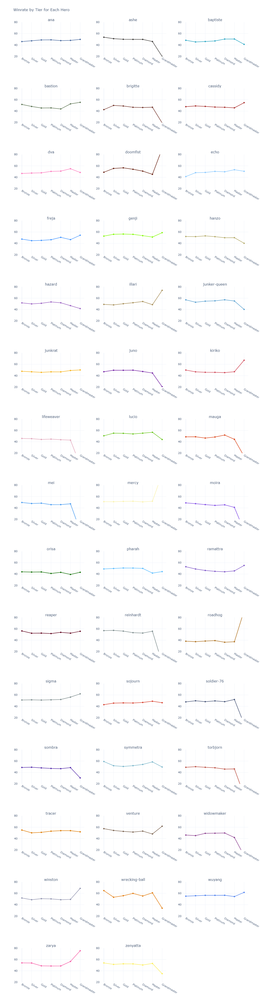
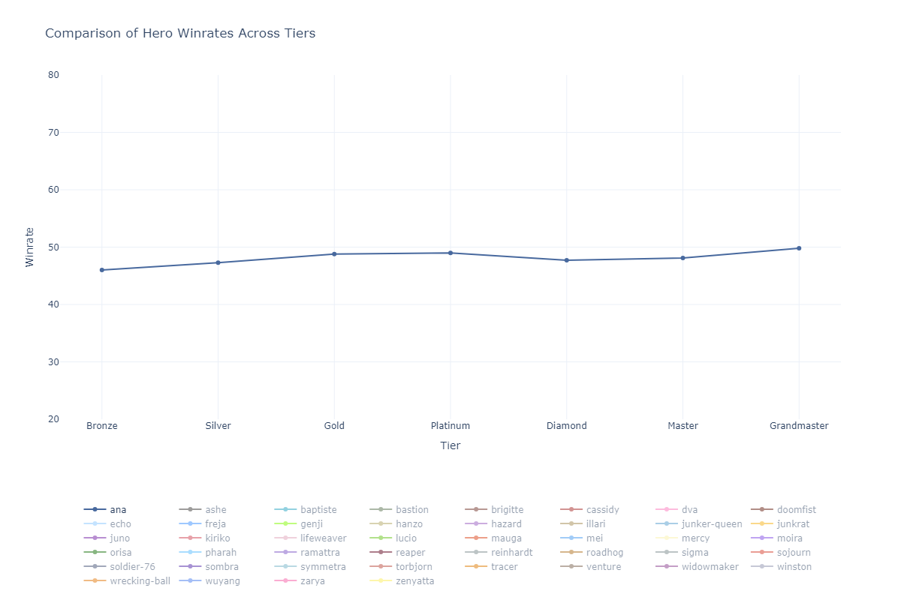

# Overwatch 2 Hero Stats – Scraper and Analysis

This project scrapes Overwatch 2 hero statistics from Blizzard's public rates data endpoint and exports normalized CSVs for analysis. It also includes a Jupyter notebook for exploring and visualizing the data, with example graphs included below.

## Features

- Scrape hero stats across combinations of filters: input (PC/Controller), region (Europe/US/Asia), role (All/Damage/Tank/Support), role-queue flag (rq 0/1), tier (All → Grandmaster), and maps (currently all-maps)
- Robust fetching with retries, polite delays, and logging to `overwatch_scraper.log`
- Flexible CLI to scrape a single combination or iterate over many
- Exports tidy CSVs named by parameter combination into `data/`
- Example analysis in `analysis.ipynb` with sample visualizations

## Requirements

- Python 3.9+
- Install dependencies:

```bash
pip install -r requirements.txt
```

## Usage

The scraper lives in `overwatch_scraper.py` and supports two modes: all combinations (optionally limited) and a single combination.

- Show help

```bash
python overwatch_scraper.py --help
```

- Scrape a limited number of combinations (good for testing)

```bash
python overwatch_scraper.py --limit 5
```

- Scrape a single combination

```bash
python overwatch_scraper.py \
  --single \
  --input PC \
  --map all-maps \
  --region Europe \
  --role All \
  --rq 1 \
  --tier Gold
```

Outputs are saved as CSV files in `data/`, using a descriptive filename:

```
stats_input-<input>_map-<map>_region-<region>_role-<role>_rq-<rq>_tier-<tier>.csv
```

Examples:
- `data/stats_input-pc_map-all-maps_region-europe_role-all_rq-1_tier-all.csv`
- `data/stats_input-controller_map-all-maps_region-asia_role-all_rq-0_tier-all.csv`

## Data source

Hero stats are fetched from Blizzard's public Overwatch rates page data endpoint. A typical query looks like:

```
https://overwatch.blizzard.com/en-us/rates/data/?input=PC&map=all-maps&region=Europe&role=All&rq=1&tier=All
```

Parameters include `input`, `map`, `region`, `role`, `rq`, and `tier`. The scraper constructs URLs accordingly and normalizes the returned JSON into tabular records.

Note: This project is for educational and analytical purposes. Be respectful with request rates; the scraper includes a delay and retry/backoff logic.

## Analysis notebook

The `analysis.ipynb` notebook demonstrates basic data exploration and visualization using the exported CSVs. You can launch it with Jupyter:

```bash
jupyter notebook analysis.ipynb
```

or within your preferred environment (e.g., VS Code, JupyterLab).

## Example graphs

These images are generated from the analysis notebook and included to showcase sample outputs.

- By tier comparison



- Controller vs PC comparison



## Logging

Run logs are written to `overwatch_scraper.log` and mirrored to stdout.

## Project structure

```
.
├── analysis.ipynb
├── by_tier.png
├── comparison.png
├── data/
├── example.json
├── overwatch_scraper.log
├── overwatch_scraper.py
├── requirements.txt
```

## License

MIT (or your preferred license).
